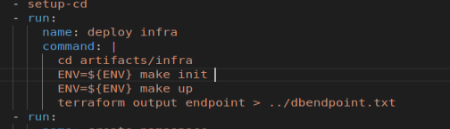

# ACME App

To stand up the infrastructures go into the `environment` directory and follow the command in _Makefile_:
- make up    &nbsp;&nbsp;   (to spin up the infrastrucure of AWS)
- make kube-up &nbsp;&nbsp; (to spind up the infrastcure of K8 cluster)
To stand up RDS cluster go to `infra` directory and run the below command:
- ENV=${env} make init &nbsp;&nbsp; (To initialize terraform remote backend with correct environment)
- ENV=${env} make up &nbsp;&nbsp;   (Spin up the regarding AWS infrastructure for RDS cluster)

## Pass Level
### Part B
Firstly, create a folder in order to store helm chart for later use. Name it `helm` 
- mkdir helm 

Helm chart are used to deploy an application, or one component of a large application on Kubernete. To generate 
The Helm chart for kubernete, use the command below
- cd helm 
- helm create acme helm
 

Change the directory into the generated helm chart, we need to clean up the stuff we don't need.
- cd acme
- rmdir charts
- rm -rf templates/* 
- cd templates 
A helm chart will always contain at least a Deployment and a Service, we need to create them now
- touch deployment.yml
- touch service.yml 

__Deployment.yml__
 
We will be describing what the application will look like when it is running on kubernetes. Firstly, we need to define 
which API version we are using and what kind of file this in first two rows.

 

Metadata is used for giving the deployment a name.
 

 
Next we will add the specification of the deployment. The _selector_ we use to identify the pods we manage, the _replica_ 
defines the number of pods that will be deployed. _Template_ which describes the pods themselves.
 

 
Then we need to define the specification for the _Containers_ we will run in the pod. In the case we will need to pull the 
docker image been generated by CI pipeline that pushed to AWS ECR service. Copy its URI into _values.yml_ file that used to
store the value of variables. To pass it into deployment.yml, we use { {&nbsp;.Values.image&nbsp; } } syntax to do that. 
 

 

Once we done that, we need to specify its enviornment variable of database to get the app connect with database. To do that,
we need to specify its _dbHostName_, _dbName_, _dbUser_ and _dbPassword_ to get it connected. Finally we need to specify the 
port allow traffic get in. To do that, you can either shift the default port under the file `www` under the directory _src/bin_
to change it to port 80 to replace 3000 (that's because we are using port 80 for load balancer to receive ingress traffic later). 
Or you can do is pass the port 80 straight way in to deployment.yml file without changing the `www` file. 

We keep the environment variables as default except the _dbHost_ that we going to use the RDS cluster we are building. To do that,
we need to change the directory into _infra_folder, pass in the terrafor output generated by environment folder, into the _Makefile_.
Then run -ENV=prod make init to spin up a new remote backend for production environment, then pass the generated value of VPC and 
subnets into _terraform.tfvars_ file. Finally by running -ENV=prod make up to spin up the RDS cluster into corresponding mode, store 
the output into _values.yml_ that used to be passed in _dbHostName_ vairable.
 

 

The __values.yml__ file looks like
 

 

After everthing is done, we can deploy the appication to kubernetes cluster, by doing the command below:
- kubectl apply -f deployment.yml
 

 

__service.yml__
 
The application now is deployed to kubernetes cluster and be accessible internally, but for make it publicly we need to define a way 
for external user to access it. We do that by defining a service and setting up an ingress through a load balancer.
We specify the version as same as deployment, but change the kind to _Service_ instead 
 
The port section matches the port from deployment, and it will open the port and map from port to targetPort, by using TCP protocal.
The load balancer will be created by kubernetes and configured for us to be our ingress automatically. 
 

 
Now that the manifest is complete, we will apply it on kubernetes cluster by
-kubectl apply -f service.yml
 

 

Once you done that, get the elb IP by use
-kubectl get services 
Pick the one with our project name, wait for few minutes for elb to configure itsleves properly.

Now you only need to do some steps before look the app with db setup from the browser. You have to pass in the dbendpoint from `infra` directory. Basically we need that output as the dbHost of our application, so we need to store the value of it. To do that run the command below:
- terraform output endpoint > ../dbendpoint.txt
 

The dbendpoint will be stored in dbendpoint.txt in root directory. 
 

Package up the helm chart
- helm package helm/acme
 

 
Now the helm chart is been packed up, we need to pass in the dbendpoint as dbHost to the application as the final step, by doing the command:
- helm upgrade acme ./helm/acme-0.1.0.tgz -i --set dbhost=$(cat ../dbendpoint.txt)
 

Check whether the setting is correct by doing
- kubectl get pods
 

 

The status of each pods should be running once it is upgraded by the dbhost.
 
Now get the external url of load balancer, paste it on browser, wait it for few minutes, you should see the application now.
 

 

    
### Part C
 

To make everything work from CI container, firstly __delete__ the application from kubernetes that just been deployed from local to get rid of potential troubles. 
 (Tips:Regarding kubernete can be deployed from anywhere once the corresponding infrastructures has been spinned up, you will not be able to difference the application whether spin up by local or CI. That's the reason why to delete it from local.)
- kubectl delete deployment acme
- kubectl delete service acme
 

After the application is been cleaned up from local, we can start deploy it from CI task. Before that we need to spin up the RDS cluster with the environment intended, the requirement is to deploy it in the mode other than __production__, in the case we are deploying the app in __e2e__ mode. 
 
To do that we specify the variable _ENV_ under the environment section from CI, make its value as "e2e".
 

 

After that, we need to deploy corresponding infrastructures for the application, in order to spin up everything under __e2e__ environment, pass the _ENV_ variable with _make_ command. Store the dbhost endpoint like what we did in Part B.
 

 
 

 

Namespaces are intended for use in environments with many users spread across multiple teams, namespace divide cluster resources for multiple users. In the case we create a namespace with environment name, also regarding the namespace attribute has to unique in global, we make a bash if else statement to determine whether the namespace is been created, if it is we should skip the process to get rid of the error. 
 

 

Furthemore, upgrade the application with new generated docker image by AWS ECR and the dbendpoint as dbhost to make the application accessible to internet wide. Regarding the application is packed up already from __package__ step, we only need to upgrade the application with these two new variables.
 

 
 

 

The reason we don't need to create the helm release before upgrade command, __-i__ take cares of it to install the release if it doesn't exist.
 

Last thing is to migrate the database and seed data for application
-db:migrate
is the command designated for db migration, also the command for migration can be found at `README.md` under _src_ folder.
 

 

Then the CI creates the fully functional application. Part C is finished.
 

 
 

 

## Credit Level
### Part D (e2e test)
E2E(end to end)testing refers to a software testing method that involves testing an application's workflow from beginning to end. In the case we leverage qawolf testing as a tool that can help us create browser tests and run them in CI. 
 

What we need to modify is to change the __DB_HOSTNAME__ variable points to our created RDS cluster as application backend. Becuase the qawolf requires the URL of application we pass in the external address of application with the new variable __URL__ specifed under _environment_ in CI. Also pass in the default database variable to get it connected.
 

 

Remember to add _http:_ before the address of load balancer to make it accessible.

Also when running the e2e test, we need to figure it out the __endpoint__ of our application which is the defined _URL_ 
 

 

Once you done everything above, make a commit and push it to CI.
 

 

With the intented results
 

 

## Distinction Level
### Part E (deploy-production)
Now we are heading to deploy the application in __production__ mode, the procedure is quiet similar with how we deployed with e2e environment, regarding we are passing the variable __ENV__ into following commandsthe, the only difference is to define its __ENV__ variable as _production_.
 

 

 Then copy and paste the CI jobs for _deploy-e2e_ to deploy-production, you have to notice the indentation of the CI jobs. 
 

 

### Part F (stage gate)
After deploy the application under production environment successful, we can manipulate the workflow with an __approval__ as a stage gate. If we want to be able to only deploy approved changes to production. This will allow us to validate tha.
 

 

On CI side, you will get the pipeline like
 

 

You have to manually approve it to keep the rest of pipeline, otherwise it hangs there.
 

 

Then you are getting a pipeline with everthing pass.
 

 

## HD Level
### Part G (CloudWatch and Logging)

We will leverage __FluentD__ daemon-set on the k8 cluster to push logs from all the nodes to AWS CloudWatch so we can make further queries and monitorying.

First thing we will create a seperate cluster for us to deploy __FluentD__ by creating a new namespace on k8.
- kubectl create namespace amazon-cloudwatch
 

 

Next we will create a configuration map for the fluentd service
 

 

Next create a new yaml file and apply the manifest file for __fluend__. The content of the manifest file can be download on internet.
 

 

To check whether the services is been configured, go to AWS CloudWatch service. We can see the _Logs Group_ is been configured for the application in each of the environments. Which means the __fluentd__ works now.
 

 

Once the application has finished spin up the __fluentd__ will start sending logs into __CloudWatch__ , you should see the logs entries from AWS Console.
 

 

Selete the correct logs group from the drop down list, and run the query. You should get the logs from all diferent containers running on the cluster, good job.
 

 